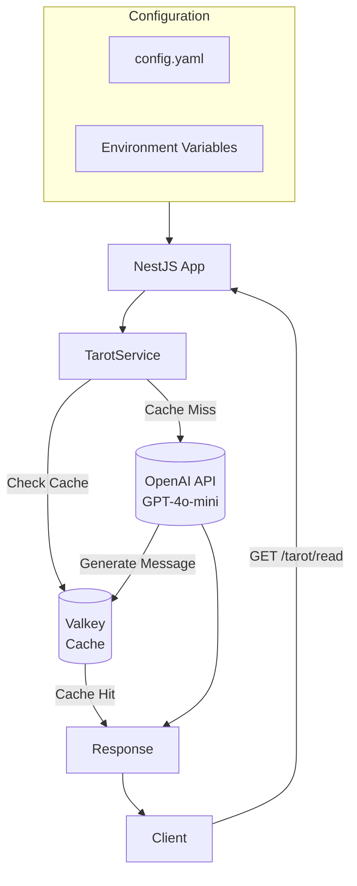
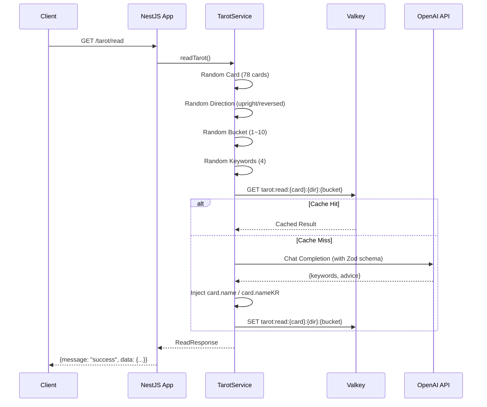

# Tarot Core API

AI-powered tarot card reading service. Uses OpenAI GPT-4o-mini to generate fortune-telling messages from randomly drawn tarot cards, with Valkey caching for performance optimization.

---

## Tech Stack

| Layer | Technology |
|------|------|
| **Framework** | NestJS v11 + TypeScript |
| **AI** | OpenAI API (gpt-4o-mini) |
| **Cache** | Valkey (Redis-compatible, via ioredis) |
| **Validation** | Zod |
| **Config** | YAML + environment variable overrides |
| **Container** | Docker (multi-stage build) |
| **Orchestration** | Kubernetes (Helm Chart) |

---

## Architecture



---

## Flow



---

## API

### Health Check
```
GET /health
```

### Tarot Reading
```
GET /tarot/read
```

**Response**
```json
{
  "message": "success",
  "data": {
    "title": "The Fool",
    "titleKR": "바보",
    "keywords": ["사랑", "시작", "설렘", "인간관계"],
    "advice": "새로운 시작을 두려워하지 마세요..."
  }
}
```

---

## Configuration

Configuration is YAML-based and can be overridden with environment variables.

### Priority (high to low)
1. Environment variables (`OPENAI_API_KEY`, `VALKEY_PASSWORD`, etc.)
2. YAML file (`CONFIG_PATH` or default `/app/config/config.yaml`)
3. Hardcoded defaults

### Environment Variables

| Variable | Description | Required |
|------|------|------|
| `OPENAI_API_KEY` | OpenAI API key | **Yes** |
| `VALKEY_PASSWORD` | Valkey password | No |
| `VALKEY_HOST` | Valkey host (default: valkey) | No |
| `VALKEY_PORT` | Valkey port (default: 6379) | No |
| `VALKEY_PREFIX` | Key prefix | No |
| `CONFIG_PATH` | YAML config file path | No |

---

## Run

### Local Development
```bash
npm install
npm run start:dev
```

### Production
```bash
npm run build
npm run start:prod
```

### Test
```bash
npm run test        # unit tests
npm run test:e2e    # E2E tests
npm run test:cov    # coverage
```

---

## Deploy

### Docker
```bash
make docker-build
```

### Kubernetes (Helm)
```bash
make helm-install HELM_VALUES="--set config.openai.existingSecret=openai-secret"
```

---

## Project Structure

```
src/
├── config/          # YAML load, validation, env overrides
├── controllers/     # HTTP request handlers
├── filters/         # Exception filters
├── modules/         # NestJS modules
├── schemas/         # Zod schemas
└── services/        # Business logic (Tarot, OpenAI, Valkey)
```
